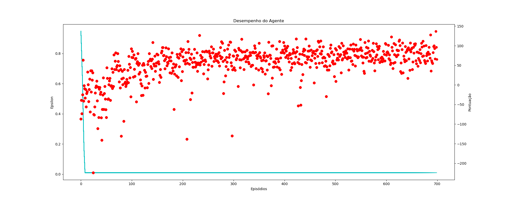

<h1>LUNAR LANDER - DEEP Q-LEARNING</h1>

Implementação do OpenAI Gym Lunar Lander com Deep Q-Learning, o objetivo do agente é pousar o modulo lunar na região delimitada pelas bandeiras.

<h2>HIPERPARÂMETROS</h2>

<h3>Agente</h3>

<ul>
    <li>EPSILON -> 1.0</li>
    <li>EPSILON_D -> 0.01</li>
    <li>EPSILON_M -> 0.001</li>
    <li>EPISÓDIOS -> 700</li>
    <li>GAMMA -> 0.99</li>
    <li>TX APRENDIZAGEM -> 0.001</li>
    <li>TAMANHO DA MEMÓRIA -> 1000000</li>
    <li>TAMANHO DO LOTE -> 64</li>
</ul>

<h3>Rede Neural</h3>
<ul>
    <li> 1 -> Camada de entrada com 8 neuronios </li>
    <li> 3 -> Camadas ocultas com 32 neuronios com bias 0. f: relu </li>
    <li> 1 -> Camada de saidas com 4 neuronios com bias 0.  f: linear </li>
</ul>

<h2>DESEMPENHO/TREINAMENTO</h2>

<h2>PRÉ-REQUISITOS</h2>
<ul>
    <li>Python -> 3.8</li>
    <li>Pacotes -> requirements.txt</li>
</ul>
 

<h2>DEMO</h2>

<strong>Link:</strong> https://youtu.be/v00rulenDrY 
